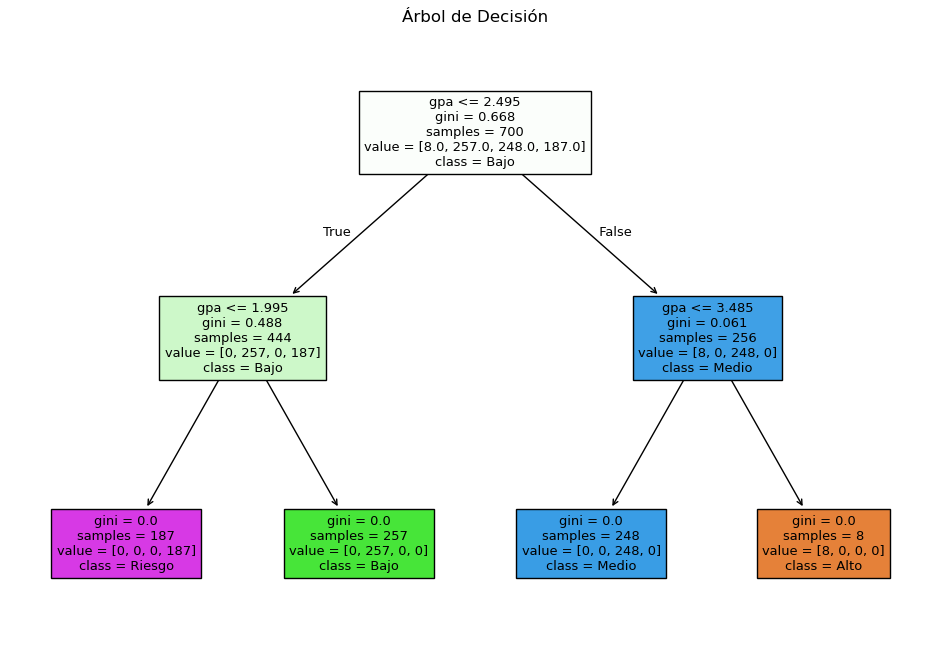
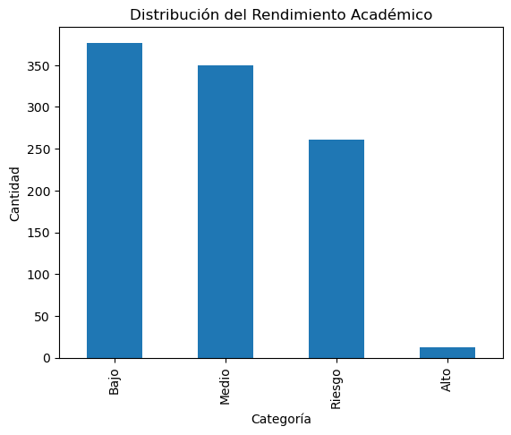
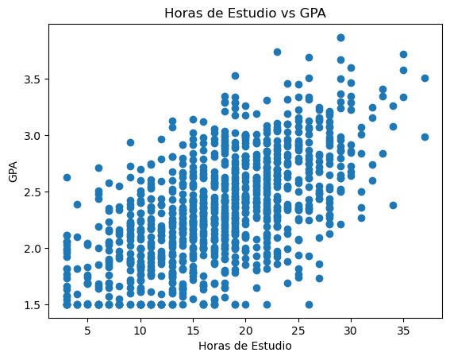
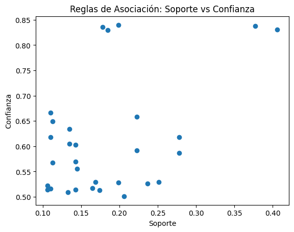

# 📊 Proyecto de Minería de Datos  
## Análisis de Rendimiento Académico y Riesgo de Abandono

---

## 🎯 Descripción del Proyecto

Este proyecto tiene como objetivo aplicar técnicas de minería de datos para analizar el rendimiento académico de estudiantes universitarios e identificar patrones que permitan detectar posibles casos de bajo desempeño o riesgo de abandono.

A través del uso de Python en Google Colab, se busca transformar datos en información útil que apoye la toma de decisiones académicas.

---

## 👥 Stakeholders

- Estudiantes  
- Docente de la asignatura  
- (Simulado) Coordinación académica  

---

## 📂 Dataset

Se utilizará un dataset simulado (mock data) que representa información de estudiantes universitarios.

### 📋 Variables incluidas:

- Edad  
- Género  
- Carrera  
- Materias inscritas  
- Horas de estudio por semana  
- Asistencia (%)  
- Uso de plataformas virtuales  
- Promedio (GPA)  
- Trabajo (Sí/No)  
- Acceso a internet (Sí/No)  

### 🎯 Variable objetivo:

- Nivel de rendimiento:
  - Alto  
  - Medio  
  - Bajo  
  - Riesgo de retiro  

---

## ⚙️ Tecnologías y Herramientas

- Python  
- Google Colab  
- Librerías:
  - pandas  
  - matplotlib  
  - seaborn  
  - sklearn

---

## 🔍 Metodología

El proyecto se desarrolla en las siguientes etapas:

### 1. Carga y exploración de datos
- Lectura del dataset  
- Identificación de variables  
- Análisis inicial  

### 2. Limpieza de datos
- Manejo de valores nulos  
- Corrección de inconsistencias  

### 3. Análisis exploratorio
- Estadísticas descriptivas  
- Visualización de datos  
- Identificación de patrones  

### 4. Aplicación de técnicas de minería de datos

#### 🌳 Árbol de Decisión
- Clasificación del rendimiento académico  
- Identificación de variables más influyentes  

#### 🧺 Reglas de Asociación
- Descubrimiento de relaciones entre variables  
- Generación de patrones tipo IF-THEN  

---

## 📊 Resultados Esperados

- Identificación de factores clave en el rendimiento académico  
- Detección de estudiantes en riesgo  

---

## 💡 Insights Generados

- Baja asistencia está relacionada con bajo rendimiento  
- Pocas horas de estudio aumentan el riesgo académico  
- Estudiantes que trabajan pueden presentar mayor dificultad

| Arbol de Decisión             |  Distribución de Rendimiento |
:-------------------------:|:-------------------------:
  |  

| Relación Horas de Estudio vs GPA            |  Reglas de Asociación |
:-------------------------:|:-------------------------:
  |  

---

## 🧠 Conclusiones

El proyecto demuestra cómo las técnicas de minería de datos permiten analizar grandes volúmenes de información y generar conocimiento útil.

Estos resultados pueden ser utilizados para implementar estrategias que mejoren el desempeño académico y reduzcan el riesgo de abandono.

---

## 🚀 Ejecución

1. Abrir el notebook en Google Colab  
2. Cargar el dataset  
3. Ejecutar las celdas paso a paso  
4. Analizar los resultados obtenidos  

---

## 📎 Entregables

- Python Notebook
- Dataset utilizado  
- Informe o presentación  

---

## 📌 Nota

Este proyecto utiliza datos simulados con fines educativos.
